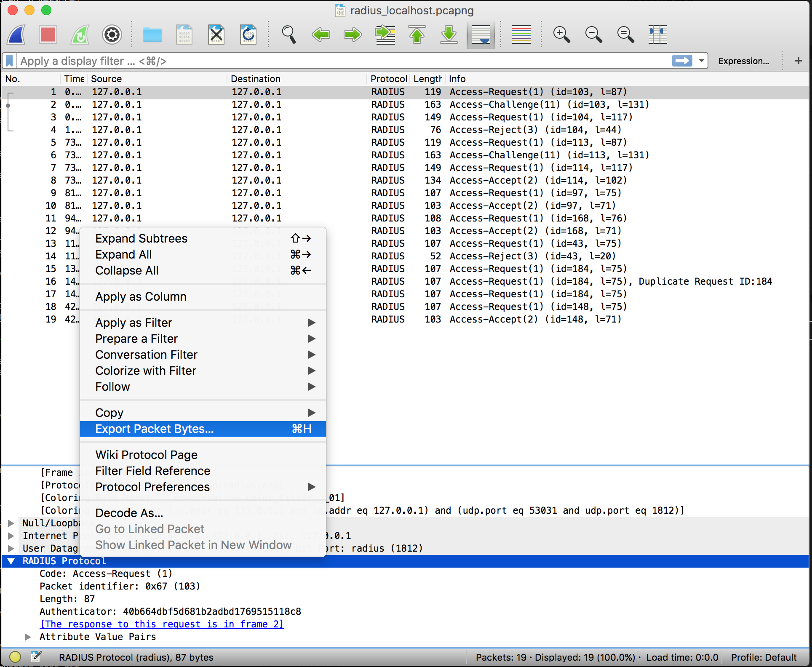

# LangSec Workshop at IEEE Security & Privacy - Hackathon

Throughout this exercise, we will guide you in developing a nom parser for the RADIUS protocol.

The different steps of the exercise are in separate folders, named "part-0", "part-1", etc.

## The RADIUS protocol

RADIUS means "Remote Authentication Dial In User Service", it is defined in the
[RFC 2865](https://tools.ietf.org/html/rfc2865). This is a binary network format,
with the following layout:

```
    0                   1                   2                   3
    0 1 2 3 4 5 6 7 8 9 0 1 2 3 4 5 6 7 8 9 0 1 2 3 4 5 6 7 8 9 0 1
   +-+-+-+-+-+-+-+-+-+-+-+-+-+-+-+-+-+-+-+-+-+-+-+-+-+-+-+-+-+-+-+-+
   |     Code      |  Identifier   |            Length             |
   +-+-+-+-+-+-+-+-+-+-+-+-+-+-+-+-+-+-+-+-+-+-+-+-+-+-+-+-+-+-+-+-+
   |                                                               |
   |                         Authenticator                         |
   |                                                               |
   |                                                               |
   +-+-+-+-+-+-+-+-+-+-+-+-+-+-+-+-+-+-+-+-+-+-+-+-+-+-+-+-+-+-+-+-+
   |  Attributes ...
   +-+-+-+-+-+-+-+-+-+-+-+-+-

   Code

      The Code field is one octet, and identifies the type of RADIUS
      packet.  When a packet is received with an invalid Code field, it
      is silently discarded.

      RADIUS Codes (decimal) are assigned as follows:

        1       Access-Request
        2       Access-Accept
        3       Access-Reject
        4       Accounting-Request
        5       Accounting-Response
       11       Access-Challenge
       12       Status-Server (experimental)
       13       Status-Client (experimental)
      255       Reserved

```

## Part 0 - prerequisites

## Installing Rust

First, you need to install Rust on your machine. The most common way is through
[Rustup](https://www.rustup.rs/), a tool used to manage different versions of Rust.
Yopu can install it directly like this:

```
curl https://sh.rustup.rs -sSf | sh
```

We will use the nightly version of Rust for this (at least from `1.18.0-nightly (036983201 2017-04-26)`).

## Creating a project

Rust uses the `cargo` package manager to create projects, handle dependencies and
manage project builds. To create your first project, run the following command:

```
cargo new radius
```

The project has the following layout:

```
radius/
├── Cargo.toml
└── src
    └── lib.rs
```

The `Cargo.toml` file holds project metadata and dependencies. All of the code for
our library will be stored in the `src` folder.

## Importing dependencies

We will import [nom](https://github.com/geal/nom), the parser combinators library,
into our Rust project, by editing the `Cargo.toml` file:

```toml
[package]
name = "radius"
version = "0.1.0"
authors = ["it's you!"]

[dependencies]
nom = "^3.0"
```

Dependencies in Rust are usually defined by a version (with [semantic versioning](http://semver.org/)
for version constraints), to download them from [crates.io](https://crates.io), the package
repository for Rust. You can also [import other projects by path for URL to a git
repository](http://doc.crates.io/specifying-dependencies.html). Rust packages are
named "crates".

To actually use the dependency in our code, we must import the new library in `src/lib.rs`:

```rust
#[macro_use] extern crate nom;

#[cfg(test)]
mod tests {
    #[test]
    fn it_works() {
    }
}

```

We use `extern crate` for most import. For nom, we use the `macro_use` attribute to also import
its macros.

Now, we can build and the project:

```
$ cargo test
    Updating registry `https://github.com/rust-lang/crates.io-index`
   Compiling nom v3.0.0
   Compiling radius v0.1.0 (file:///Users/geal/presentations/langsec-2017-hackathon-code/radius)
warning: unused `#[macro_use]` import
 --> src/lib.rs:1:1
  |
1 | #[macro_use] extern crate nom;
  | ^^^^^^^^^^^^
  |
  = note: #[warn(unused_imports)] on by default

warning: unused `#[macro_use]` import
 --> src/lib.rs:1:1
  |
1 | #[macro_use] extern crate nom;
  | ^^^^^^^^^^^^
  |
  = note: #[warn(unused_imports)] on by default

    Finished dev [unoptimized + debuginfo] target(s) in 3.81 secs
     Running target/debug/deps/radius-762b6b3206085f4b

running 1 test
test tests::it_works ... ok

test result: ok. 1 passed; 0 failed; 0 ignored; 0 measured

   Doc-tests radius

running 0 tests

test result: ok. 0 passed; 0 failed; 0 ignored; 0 measured
```

Rust includes a facility for unit testing with cargo and rustc, its compiler.
You'll see the `target/` folder just appeared: it will hold all the temporary
files for compilation, and the output files.

The `Cargo.lock` file was also created. It holds a list of the dependencies
downloaded. It is not very useful for libraries, but for executables, you would
usually commit this file, to fix the exact set of dependencies to use when
building the project (you can update the dependencies list with `cargo update`).

## Part 1: information gathering

To write a new parser, we need mainly three things:

- [specifications](https://tools.ietf.org/html/rfc2865)
- samples. For a network protocol, we can get some from [the WireShark wiki](https://wiki.wireshark.org/SampleCaptures)
- a way to compare our implementation with other ones. In our case, we can compare to the output of WireShark.
you can download Wireshark [here](https://www.wireshark.org/)

Since the data we want to parse is embeded in UCP packets inside a PCAP file,
we need to extract the raw bytes of the RADIUS protocol (unless you want to
also make a PCAP, IP and UDP parsers as well).

Select a packet, and in the lower window, right click on "Radius Protocol" and
choose "Export Packet Bytes":



the `assets/` folder at the root of the project already contains some PCAP
traces and a few extracted RADIUS frames, so you can skip to Part 2.

## Part 2: start implementing the parser

Open the `assets/radius_localhost.pcapng` file and select the first packet. The raw data
corresponding to this packet is in `assets/radius-access-request.bin` (each raw data file
corresponds to the first appearance of that RADIUS packet type in the trace).

To begin parsing, we need to load the data in a buffer and observe it. Tahnkfully, Rust
provides a nice feature called `include_bytes`. This macro will, at compile time, embed
the content of a file as a byte array in your code. In `src/lib.rs`:

```rust
#[cfg(test)]
mod tests {
    const access_request   : &[u8] = include_bytes!("../../../assets/radius-access-request.bin");
    const access_challenge : &[u8] = include_bytes!("../../../assets/radius-access-challenge.bin");
    const access_reject    : &[u8] = include_bytes!("../../../assets/radius-access-reject.bin");
    const access_accept    : &[u8] = include_bytes!("../../../assets/radius-access-accept.bin");
```

Each of the `access_*` variables is a "byte slice", as indicated by the type `&[u8]`. This
data type is fundamental in the way nom is built. It contains a pointer to the start of the
data, and a length. nom will move from slices like this from one parser to the next, avoiding
data copies in the process.

We can now access those slices and observe their content. A great way to explore a byte slice
is to reuse nom's hex viewer:

```rust
    // import the HexDisplay trait to activate the feature on slices
    use nom::HexDisplay;

    [...]

    #[test]
    fn print() {
        println!("hexdump:\n{}", access_request.to_hex(16));
        // adding a panic here to fail the test, otherwise the println output would be silent
        panic!();
    }
```

If you try to test the code, it should give you the following output:

```
$ cargo test
    Finished dev [unoptimized + debuginfo] target(s) in 0.0 secs
     Running target/debug/deps/radius-762b6b3206085f4b

running 2 tests
test tests::it_works ... ok
test tests::print ... FAILED

failures:

---- tests::print stdout ----
        hexdump:
00000000        01 67 00 57 40 b6 64 db f5 d6 81 b2 ad bd 17 69         .g.W@�d��ց���.i
00000010        51 51 18 c8 01 07 73 74 65 76 65 02 12 db c6 c4         QQ.�..steve..���
00000020        b7 58 be 14 f0 05 b3 87 7c 9e 2f b6 01 04 06 c0         �X�.�.��|�/�...�
00000030        a8 00 1c 05 06 00 00 00 7b 50 12 5f 0f 86 47 e8         �.......{P._.�G�
00000040        c8 9b d8 81 36 42 68 fc d0 45 32 4f 0c 02 66 00         ț؁6Bh��E2O..f.
00000050        0a 01 73 74 65 76 65                                    ..steve

thread 'tests::print' panicked at 'explicit panic', src/lib.rs:15
note: Run with `RUST_BACKTRACE=1` for a backtrace.


failures:
    tests::print

test result: FAILED. 1 passed; 1 failed; 0 ignored; 0 measured

error: test failed, to rerun pass '--lib'
```

The hexadecimal viewer is useful to verify what nom returned is what you expected.

### Let's write the first parser

We'll start by defining the enum for RADIUS codes:

```rust
#[derive(Debug,PartialEq)]
#[repr(u8)]
pub enum RadiusCode {
    AccessRequest = 1,
    AccessAccept = 2,
    AccessReject = 3,
    AccountingRequest = 4,
    AccountingResponse = 5,
    AccessChallenge = 11,
    StatusServer = 12,
    StatusClient = 13,
    Reserved = 255,
}
```

The `derive` attributes are there to add features to the enum:
- `Debug` to easily print the value
- `PartialEq` to compare it to another

The `#repr(u8)]` attribute indicates that the value in memory will be an
unsigned byte.

Now, we define the structure to hold RADIUS data:

```rust
#[derive(Debug,PartialEq)]
pub struct RadiusData<'a> {
    pub code: u8,
    pub identifier: u8,
    pub length: u16,
    pub authenticator: &'a [u8], // 16 bytes
    pub attributes: Option<&'a[u8]>,
}
```

Note the following points:

- The <'a> notation is the declaration of a lifetime. It is used by Rust to
ensure that pointers on data (authenticator and attributes) will never be
freed before a RadiusData object containing them. This is the Rust way of
safely managing memory without a garbage collector.
- The `Option` type is an enum that represents either `Some(value)` (there is
a value) or `None` (there is no value).

The goal of the nom parser will be to generate this structure from raw data.
We use nom to describe how to read each field. Since the definition of radius
data is very simple, we'll only have to use basic functions to read the
fields as big-endian integers, and take a number of bytes for the other fields.

The parser will then build and return a structure `RadiusData`.

```rust
pub fn parse_radius_data(i:&[u8]) -> IResult<&[u8],RadiusData> {
    do_parse!(i,
        c:    be_u8 >>
        id:   be_u8 >>
        len:  be_u16 >>
        auth: take!(16) >>
        attr: cond!(len > 20, take!(len - 20)) >>
        (
            RadiusData {
                code: c,
                identifier: id,
                length: len,
                authenticator: auth,
                attributes: attr,
            }
        )
    )
}
```

It uses the big endian unsigned integer parsers, so add the following at the
top of the file, after the `extern crate` declaration, to import those
functions: `use nom::{be_u8, be_u16, IResult};`

Notes:

No allocation is required: the RadiusData structure is allocated on the stack,
and ownership will be transferred to the caller function. Rust takes care of
the memory.
Parser is zero-copy: when taking data (for ex. in auth: take!(16), nothing is
allocated or copied: only a sub-slice is created (represented in memory as a
pointer + length).

### Let's test the parser

Now, we need to test that the parser works as expected. Let's add in a unit
test to try and parse the access request:

```
use nom::{HexDisplay,IResult,Needed};
use super::{parse_radius_data,RadiusData};
#[test]
fn basic_radius_data() {
    println!("hexdump:\n{}", access_request.to_hex(16));

    assert_eq!(
        parse_radius_data(access_request),
        IResult::Done(
            &access_request[access_request.len()..],
            RadiusData {
                code: 1,
                identifier: 103,
                length: 87,
                authenticator: &access_request[4..20],
                attributes:    Some(&access_request[20..])
            }
        )
    );
}
```

## Part 3: improve the parser

Our parser only reads the very basic fields of RADIUS data, it does not support reading attributes for now.

The specifications define the attributes as following:

```
   A summary of the Attribute format is shown below.  The fields are
   transmitted from left to right.

    0                   1                   2
    0 1 2 3 4 5 6 7 8 9 0 1 2 3 4 5 6 7 8 9 0
   +-+-+-+-+-+-+-+-+-+-+-+-+-+-+-+-+-+-+-+-+-+-
   |     Type      |    Length     |  Value ...
   +-+-+-+-+-+-+-+-+-+-+-+-+-+-+-+-+-+-+-+-+-+-
```

Attributes are simple TLVs, and a list of known types is also defined in the specifications.

There are two different strategies here: we could only read the TLV structures and store them
as opaque values, or we can parse them in depth. For this tutorial, we'll do implement both
solutions, to improve our parser incrementally.

Define the structure:

```rust
#[derive(Debug,PartialEq)]
pub struct RadiusAttribute<'a> {
    pub typ: u8,
    pub len: u8,
    pub val: &'a [u8],
}
```

Write the parser for an attribute:

```rust
pub fn parse_radius_attribute(i:&[u8]) -> IResult<&[u8],RadiusAttribute> {
    do_parse!(i,
        t: be_u8 >>
        l: be_u8 >>
        v: take!(l-2) >>
        (
            RadiusAttribute {
                typ: t,
                len: l,
                val: v,
            }
        )
    )
}
```

We now need to call our parser for attributes from the `RadiusData` parser.
This is where nom is great: it allows to combine parsers very easily. We
have a parser for one attribute. To read many attributes at once (reapplying
the parser), we can use:

```rust
many1(i, parse_radius_attribute)
```

What we need here is a bit more complicated: we want to take some bytes
and apply the parser only to these bytes. In the `parse_radius_data` function,
the parsing of attributes becomes:

```rust
attr: cond!(len > 20,
            flat_map!(take!(len - 20),complete!(many1!(parse_radius_attribute)))
) >>
```

Then, the structure must be adapted, since instead of a slice, we now need to
store a vector of `RadiusAttribute`:

```rust
pub struct RadiusData<'a> {
    // [fields omitted]
    pub attributes: Option<Vec<RadiusAttribute<'a>>>,
}
```

Note: The expression `take!(l-2)` is dangerous, since if `l` is 0 or 1, this would
result in a attempt to read a negative length. In debug mode, this attempt will
be detected (and code will panic), but not in release mode. To prevent that, `l`
must be tested.

## Fuzzing

Even with a memory safe language like Rust, and a parser combinators library like
nom, parsing bugs can still appear. We will employ [cargo-fuzz](https://github.com/rust-fuzz/cargo-fuzz),
a wrapper around [libFuzzer](http://llvm.org/docs/LibFuzzer.html).

Install `cargo-fuzz` like this:

```
cargo install cargo-fuzz
```

Then set up fuzzing in the project:

```
cd part-4/radius && cargo fuzz init
```

This will create the `fuzz/` directory in your project, with the following content:

```
fuzz/
├── Cargo.toml
└── fuzzers
    └── fuzzer_script_1.rs
```

Let's use our parser in the generated fuzzer script:

```rust
#![no_main]
#[macro_use] extern crate libfuzzer_sys;
extern crate radius;

use radius::parse_radius_data;

fuzz_target!(|data: &[u8]| {
    let result = parse_radius_data(data);
});
```

`cargo-fuzz` will repeatedly call our parser with byte slices, trying to crash it.
Let's run it:

```
    Finished dev [unoptimized + debuginfo] target(s) in 13.58 secs
     Running `fuzz/target/x86_64-apple-darwin/debug/fuzzer_script_1 -artifact_prefix=/Users/geal/presentations/langsec-2017-hackathon-code/part-5/radius/fuzz/artifacts/fuzzer_script_1/ /Users/geal/presentations/langsec-2017-hackathon-code/part-5/radius/fuzz/corpus/fuzzer_script
_1`
INFO: Seed: 1461186425
INFO: Loaded 0 modules (0 guards):
Loading corpus dir: /Users/geal/presentations/langsec-2017-hackathon-code/part-5/radius/fuzz/corpus/fuzzer_script_1
INFO: -max_len is not provided, using 64
INFO: A corpus is not provided, starting from an empty corpus
#0      READ units: 1
#1      INITED cov: 118 corp: 1/1b exec/s: 0 rss: 14Mb
#2      NEW    cov: 127 corp: 2/3b exec/s: 0 rss: 14Mb L: 2 MS: 1 InsertByte-
#8      NEW    cov: 138 corp: 3/8b exec/s: 0 rss: 14Mb L: 5 MS: 2 CopyPart-CopyPart-
#10     NEW    cov: 174 corp: 4/72b exec/s: 0 rss: 14Mb L: 64 MS: 4 CopyPart-CopyPart-InsertByte-CrossOver-
#14     NEW    cov: 190 corp: 5/129b exec/s: 0 rss: 14Mb L: 57 MS: 3 InsertByte-ChangeByte-InsertRepeatedBytes-
#1125   NEW    cov: 320 corp: 6/193b exec/s: 0 rss: 14Mb L: 64 MS: 4 EraseBytes-ChangeByte-CopyPart-CrossOver-
#1139   NEW    cov: 321 corp: 7/250b exec/s: 0 rss: 14Mb L: 57 MS: 3 ChangeBit-ChangeBit-CrossOver-
thread '<unnamed>' panicked at 'attempt to subtract with overflow', src/lib.rs:60
note: Run with `RUST_BACKTRACE=1` for a backtrace.
==7187== ERROR: libFuzzer: deadly signal
    #0 0x106eb8500 in __sanitizer_print_stack_trace (/Users/geal/.rustup/toolchains/nightly-x86_64-apple-darwin/lib/rustlib/x86_64-apple-darwin/lib/libclang_rt.asan_osx_dynamic.dylib:x86_64+0x62500)
    #1 0x105b5d62b in fuzzer::Fuzzer::CrashCallback() (/Users/geal/presentations/langsec-2017-hackathon-code/part-5/radius/fuzz/target/x86_64-apple-darwin/debug/fuzzer_script_1:x86_64+0x10002d62b)
    #2 0x105b5d5dd in fuzzer::Fuzzer::StaticCrashSignalCallback() (/Users/geal/presentations/langsec-2017-hackathon-code/part-5/radius/fuzz/target/x86_64-apple-darwin/debug/fuzzer_script_1:x86_64+0x10002d5dd)
    #3 0x105ba6ec7 in fuzzer::CrashHandler(int, __siginfo*, void*) (/Users/geal/presentations/langsec-2017-hackathon-code/part-5/radius/fuzz/target/x86_64-apple-darwin/debug/fuzzer_script_1:x86_64+0x100076ec7)
    #4 0x7fffb5e94b39 in _sigtramp (/usr/lib/system/libsystem_platform.dylib:x86_64+0x2b39)
    #5 0x100000000  (/Users/geal/presentations/langsec-2017-hackathon-code/part-5/radius/fuzz/target/x86_64-apple-darwin/debug/fuzzer_script_1:x86_64+0xfa4d0000)
    #6 0x7fffb5d1941f in abort (/usr/lib/system/libsystem_c.dylib:x86_64+0x5f41f)
    #7 0x105bce1c8 in __rust_start_panic (/Users/geal/presentations/langsec-2017-hackathon-code/part-5/radius/fuzz/target/x86_64-apple-darwin/debug/fuzzer_script_1:x86_64+0x10009e1c8)
    #8 0x105bcccbc in rust_panic (/Users/geal/presentations/langsec-2017-hackathon-code/part-5/radius/fuzz/target/x86_64-apple-darwin/debug/fuzzer_script_1:x86_64+0x10009ccbc)
    #9 0x105bccc73 in std::panicking::rust_panic_with_hook::h2bd2f0b446f0face (/Users/geal/presentations/langsec-2017-hackathon-code/part-5/radius/fuzz/target/x86_64-apple-darwin/debug/fuzzer_script_1:x86_64+0x10009cc73)
    #10 0x105bcca64 in std::panicking::begin_panic::h1732f61ecaaa434e (/Users/geal/presentations/langsec-2017-hackathon-code/part-5/radius/fuzz/target/x86_64-apple-darwin/debug/fuzzer_script_1:x86_64+0x10009ca64)
    #11 0x105bcc9d2 in std::panicking::begin_panic_fmt::h2948dd4668f99175 (/Users/geal/presentations/langsec-2017-hackathon-code/part-5/radius/fuzz/target/x86_64-apple-darwin/debug/fuzzer_script_1:x86_64+0x10009c9d2)
    #12 0x105bcc937 in rust_begin_unwind (/Users/geal/presentations/langsec-2017-hackathon-code/part-5/radius/fuzz/target/x86_64-apple-darwin/debug/fuzzer_script_1:x86_64+0x10009c937)
    #13 0x105bce450 in core::panicking::panic_fmt::hb2e726f3b579b19d (/Users/geal/presentations/langsec-2017-hackathon-code/part-5/radius/fuzz/target/x86_64-apple-darwin/debug/fuzzer_script_1:x86_64+0x10009e450)
    #14 0x105bce354 in core::panicking::panic::hafbe89720e5223c3 (/Users/geal/presentations/langsec-2017-hackathon-code/part-5/radius/fuzz/target/x86_64-apple-darwin/debug/fuzzer_script_1:x86_64+0x10009e354)
    #15 0x105bc6944 in radius::parse_radius_attribute::h47bd8e6f1abe8fcb (/Users/geal/presentations/langsec-2017-hackathon-code/part-5/radius/fuzz/target/x86_64-apple-darwin/debug/fuzzer_script_1:x86_64+0x100096944)
    #16 0x105bbfead in radius::parse_radius_data::hf031975c47562504 (/Users/geal/presentations/langsec-2017-hackathon-code/part-5/radius/fuzz/target/x86_64-apple-darwin/debug/fuzzer_script_1:x86_64+0x10008fead)
    #17 0x105b32c15 in rust_fuzzer_test_input (/Users/geal/presentations/langsec-2017-hackathon-code/part-5/radius/fuzz/target/x86_64-apple-darwin/debug/fuzzer_script_1:x86_64+0x100002c15)
    #18 0x105b36911 in libfuzzer_sys::test_input_wrap::_$u7b$$u7b$closure$u7d$$u7d$::h99d797663140f733 (/Users/geal/presentations/langsec-2017-hackathon-code/part-5/radius/fuzz/target/x86_64-apple-darwin/debug/fuzzer_script_1:x86_64+0x100006911)
    #19 0x105b3493e in std::panicking::try::do_call::hbda0a362ff3256fe (/Users/geal/presentations/langsec-2017-hackathon-code/part-5/radius/fuzz/target/x86_64-apple-darwin/debug/fuzzer_script_1:x86_64+0x10000493e)
    #20 0x105bce1bb in __rust_maybe_catch_panic (/Users/geal/presentations/langsec-2017-hackathon-code/part-5/radius/fuzz/target/x86_64-apple-darwin/debug/fuzzer_script_1:x86_64+0x10009e1bb)
    #21 0x105b33fa4  (/Users/geal/presentations/langsec-2017-hackathon-code/part-5/radius/fuzz/target/x86_64-apple-darwin/debug/fuzzer_script_1:x86_64+0x100003fa4)
    #22 0x105b33a2c in std::panic::catch_unwind::h04ce022c4e0303bf (/Users/geal/presentations/langsec-2017-hackathon-code/part-5/radius/fuzz/target/x86_64-apple-darwin/debug/fuzzer_script_1:x86_64+0x100003a2c)
    #23 0x105b3647c in LLVMFuzzerTestOneInput (/Users/geal/presentations/langsec-2017-hackathon-code/part-5/radius/fuzz/target/x86_64-apple-darwin/debug/fuzzer_script_1:x86_64+0x10000647c)
    #24 0x105b60aff in fuzzer::Fuzzer::ExecuteCallback(unsigned char const*, unsigned long) (/Users/geal/presentations/langsec-2017-hackathon-code/part-5/radius/fuzz/target/x86_64-apple-darwin/debug/fuzzer_script_1:x86_64+0x100030aff)
    #25 0x105b60efd in fuzzer::Fuzzer::RunOne(unsigned char const*, unsigned long) (/Users/geal/presentations/langsec-2017-hackathon-code/part-5/radius/fuzz/target/x86_64-apple-darwin/debug/fuzzer_script_1:x86_64+0x100030efd)
    #26 0x105b6422d in fuzzer::Fuzzer::MutateAndTestOne() (/Users/geal/presentations/langsec-2017-hackathon-code/part-5/radius/fuzz/target/x86_64-apple-darwin/debug/fuzzer_script_1:x86_64+0x10003422d)
    #27 0x105b64c73 in fuzzer::Fuzzer::Loop() (/Users/geal/presentations/langsec-2017-hackathon-code/part-5/radius/fuzz/target/x86_64-apple-darwin/debug/fuzzer_script_1:x86_64+0x100034c73)
    #28 0x105b3fa3c in fuzzer::FuzzerDriver(int*, char***, int (*)(unsigned char const*, unsigned long)) (/Users/geal/presentations/langsec-2017-hackathon-code/part-5/radius/fuzz/target/x86_64-apple-darwin/debug/fuzzer_script_1:x86_64+0x10000fa3c)
    #29 0x105b6fd6f in main (/Users/geal/presentations/langsec-2017-hackathon-code/part-5/radius/fuzz/target/x86_64-apple-darwin/debug/fuzzer_script_1:x86_64+0x10003fd6f)
    #30 0x7fffb5c85234 in start (/usr/lib/system/libdyld.dylib:x86_64+0x5234)

NOTE: libFuzzer has rudimentary signal handlers.
      Combine libFuzzer with AddressSanitizer or similar for better crash reports.
SUMMARY: libFuzzer: deadly signal
MS: 4 ChangeBit-ChangeBit-CrossOver-CrossOver-; base unit: 1dfe937ff03d3933e93b246530d7a72f5bef2d54
0x21,0xa,0x0,0x21,0xa,0x29,0x0,0x0,0x0,0x6d,0x6d,0x6d,0x6d,0xed,0x6d,0x6d,0x6d,0x6d,0xa,0x6d,0xa,0xa,0x21,0x21,0xa,0x21,0xa,0x6d,0x6d,0x0,0x0,0x0,0xa,0x21,0xa,0x0,0x6d,0x6d,0x6d,0x6d,0x6d,0x6d,0x6d,0xa,0x21,0xa,0x21,0xa,0x6d,0x6d,0x6d,0x7d,0xa,
!\x0a\x00!\x0a)\x00\x00\x00mmmm\xedmmmm\x0am\x0a\x0a!!\x0a!\x0amm\x00\x00\x00\x0a!\x0a\x00mmmmmmm\x0a!\x0a!\x0ammm}\x0a
artifact_prefix='/Users/geal/presentations/langsec-2017-hackathon-code/part-5/radius/fuzz/artifacts/fuzzer_script_1/'; Test unit written to /Users/geal/presentations/langsec-2017-hackathon-code/part-5/radius/fuzz/artifacts/fuzzer_script_1/crash-d575696eb7fb470793d82e5b8f2e3a867
baf8c0d
Base64: IQoAIQopAAAAbW1tbe1tbW1tCm0KCiEhCiEKbW0AAAAKIQoAbW1tbW1tbQohCiEKbW1tfQo=
```

As expected, `cargo-fuzz` has found something! It saved a dump of the data used to crash
the parser in `fuzz/artifacts/fizzer_script_1/crash-<SOME BASE64>`.

We can now reuse this as test case in our project, ìmporting it like the other assets:

```rust
const fuzzer_sample    : &[u8] = include_bytes!("../fuzz/artifacts/fuzzer_script_1/crash-d575696eb7fb470793d82e5b8f2e3a867baf8c0d");
```

Let's add a test case with this sample:

```rust
#[test]
fn fuzzer_test() {
    let res = parse_radius_data(fuzzer_sample);
}
```

Let's run the tests, with a new environment variable, `RUST_BACKTRACE`, to display the
stack trace after a failure in a test.

```
$ RUST_BACKTRACE=1 cargo test
    Finished dev [unoptimized + debuginfo] target(s) in 0.0 secs
     Running target/debug/deps/radius-89e2b4cf971b0c5e

running 2 tests
test tests::basic_radius_data ... ok
test tests::fuzzer_test ... FAILED

failures:

---- tests::fuzzer_test stdout ----
        thread 'tests::fuzzer_test' panicked at 'attempt to subtract with overflow', src/lib.rs:60
note: Some details are omitted, run with `RUST_BACKTRACE=full` for a verbose backtrace.
stack backtrace:
   0: std::sys::imp::backtrace::tracing::imp::unwind_backtrace
   1: std::panicking::default_hook::{{closure}}
   2: std::panicking::default_hook
   3: std::panicking::rust_panic_with_hook
   4: std::panicking::begin_panic
   5: std::panicking::begin_panic_fmt
   6: rust_begin_unwind
   7: core::panicking::panic_fmt
   8: core::panicking::panic
   9: radius::parse_radius_attribute
  10: radius::parse_radius_data
  11: radius::tests::fuzzer_test
  12: <F as test::FnBox<T>>::call_box
  13: __rust_maybe_catch_panic


failures:
    tests::fuzzer_test

test result: FAILED. 1 passed; 1 failed; 0 ignored; 0 measured

error: test failed, to rerun pass '--lib'
```

Note that this is not a crash, but a panic: Rust detected an overflowing operation,
and decided to stop the program. Rust does other kinds of verifications, like
bounds checking, but those can be deactivated in release mode.

Our fuzzer detected an overflow at this line:

```rust
    l: be_u8 >>
    v: take!(l-2) >>
```

We parsed a length, and we try to substract `2` from it. The overflow happens when
the length is `0` or `1`. We can fix this by using the [`verify!`]`(https://docs.rs/nom/3.0.0/nom/macro.verify.html)
combinator, to validate a value after parsing it:

```rust
    l: verify!(be_u8, |val| val >= 2) >>
```

With this, the overflow is fixed. What happens is that verify will return an error
on the invalid length value, so the attribute parser will return an error too, and
the list of attributes will stop there.
